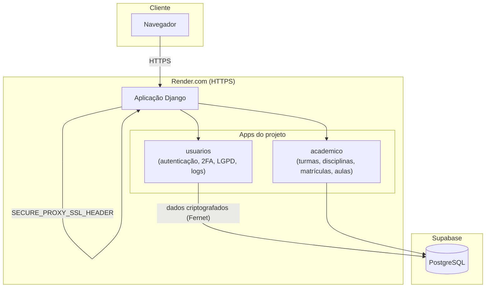

# Documentação Técnica — Autenticação e Gestão de Credenciais

## 1. Modelagem de identidade e controle de acesso

### 1.1 Usuário customizado

O sistema ao invés de usar o username ele usa o email para login. Para isso o model Usuario usa o AbstractUser do Django e removemos o campo username nativo, deixando o email como campo único e definido no USERNAME-FIELD.
A criação de usuários passa pelo UsuarioManager, que normaliza o email e aplica set_password() em todo create_user e create_superuser, para garantir que nenhum usuário e superusuário seja salvo com senha em texto puro.

### 1.2 Perfis

O Campo perfil define o papel do usuário no sistema, com as opções fixas: ADMIN, PROF, ALUNO, RESP. Esse campo que decide qual template é renderizado no dashboard após o login e no futuro define todas as permissões e areas extras de cada perfil.

### 1.3 Dados por perfil em tabelas separadas

Ao invés de colocar todos os campos específicos de aluno, professor e responsável dentro da tabela de usuários cada perfil tem sua própria tabela ligada por OneToOneField a Usuario:

- Aluno: matrícula, data de nascimento, telefone e endereço.
- Professor: formação, telefone, especialidade.
- Responsável: telefone, parentesco principal

O vínculo dentre aluno e responsável usa tabela associativa própria, AlunoResponsavel que é ManyToManyField com through, que permite um aluno ter mais de um responsável e um responsável com mais de um aluno cadastrado.

## 2. Segurança

### 2.1 Senhas

O Hash da senha é feito pelo próprio Django, o PBKDF2 por padrão, via set_password().
Além disso, o AUTH_PASSWORD_VALIDATORS está configurado no settings.py com os quatro validadores nativos do Django.

### 2.2 CSRF e acesso autenticado

CrsfViewMiddleware está ativo em MIDDLEWARE, e os formulários de login usam . As views que dependem de sessão ativa verificam request.user.is_authenticated, ou usam o decorador @login_required, e redirecionam para login caso contrário.

## 3. Banco de dados e armazenamento

### 3.1 PostgresSQL via Supabase

A conexão com o banco é lida da variável DATABASE_URL, com ssl_require=True, ou seja a conexão é recusada se não for criptografada. Permitindo trocar entre Postgres local e Supabase sem mudar código, só mudando a variável de ambiente.

## 4. Fluxo de autentificação

1. Usuário acessa a pagina principal e envia email e senha pelo formulário de Templates/usuarios/index.html.
2. login_view chama authenticate (request, email=email, password=senha).
3. Se for válido, login (request, usuario) cria a sessão e redireciona para /dashboard/
4. Se for inválido, exibe mensagem genérica de erro, "Email ou senha inválidos.", sem indicar se o email existe.
5. dashboard_view bloqueia acesso de quem não está autentificado e escolhe o template conforme o "perfil" do usuário logado.
6. logout_view que é protegida por @login_required, encerra a sessão e volta para o login.

## 5. Organização no repositório

- apps/usuarios/: models, Usuario, Aluno, Professor, Responsavel e AlunoResponsavel, UsuarioManager e as views de login, dashboard e logout.
- core/settings.py: carrega .env, define AUTH_USER_MODEL, AUTH_PASSWORD_VALIDATORS, configuração de banco e storage.
- Templates/usuarios/: telas de login e dashboard.
- .env e .env.example: variáveis de ambiente fora do versionamento.

## 6. Autenticação de dois fatores (2FA)

### 6.1 Implementação e campos do usuário

Implementado com o padrão TOTP utilizando a biblioteca pyotp, sendo compatível com aplicativos como Microsoft Authenticator e Google Authenticator. Para isso, o model Usuario recebeu dois novos campos: otp_secret, que armazena a chave secreta de validação, e otp_ativado, um boolean que indica se a proteção extra está ligada.

### 6.2 Configuração segura

Na rota /2fa/configurar/, o sistema gera a chave secreta e exibe um QR Code gerado por meio da biblioteca qrcode. O sistema só altera o otp_ativado para True no banco de dados após o usuário confirmar a ativação digitando um código válido gerado pelo seu aplicativo. Isso evita que o 2FA fique ativado acidentalmente sem que o usuário tenha configurado o app com sucesso.

### 6.3 Interceptação no fluxo de login

O fluxo tradicional de entrada foi adaptado. Após o authenticate() confirmar que o email e a senha estão corretos, o sistema verifica o status do 2FA do usuário:

- Se otp_ativado for False: O sistema chama o login(request, usuario) normalmente e redireciona para o dashboard.
- Se otp_ativado for True: O login() não é chamado. O sistema salva apenas o ID do usuário em uma variável de sessão temporária (pre_2fa_user_id) e redireciona para /2fa/verificar/.

Na etapa de verificação, somente após o código de 6 dígitos ser validado por meio de pyotp.TOTP(secret).verify(codigo) é que o login() é executado de fato e a sessão autenticada é criada. Isso garante que o conhecimento isolado da senha seja insuficiente para acessar contas com a restrição ativada.

## 7. Política de sessão e bloqueio de conta

### 7.1 Tentativas e bloqueio por conta

Além do rate limiting por IP, o model Usuario recebeu três campos novos: tentativas_login, que conta quantas vezes seguidas a senha foi digitada errada, ultima_tentativa_falha, que guarda quando foi a última tentativa errada, e bloqueado_ate, que guarda até quando a conta fica bloqueada.
Na login_view, antes de chamar authenticate(), o sistema busca o usuário pelo email e confere se bloqueado_ate ainda está no futuro. Se estiver, a tentativa é barrada e uma mensagem de bloqueio é exibida sem nem chegar a validar a senha.
Quando a senha está errada, tentativas_login é incrementado. Ao atingir o limite de 5 tentativas, bloqueado_ate recebe a data e hora atual mais 15 minutos, bloqueando a conta independente do IP de onde vem a tentativa.
Quando o login é bem sucedido, tentativas_login e bloqueado_ate são zerados, liberando o histórico de tentativas erradas anteriores.

### 7.2 Política de sessão

O settings.py define SESSION_COOKIE_AGE = 1800, ou seja a sessão expira depois de 30 minutos. Com SESSION_SAVE_EVERY_REQUEST = True, esse tempo é renovado a cada requisição, então os 30 minutos contam a partir da última ação do usuário, não do login.
SESSION_EXPIRE_AT_BROWSER_CLOSE = True também encerra a sessão quando o navegador é fechado, e SESSION_COOKIE_HTTPONLY = True impede que o cookie de sessão seja acessado via JavaScript, reduzindo o risco de roubo de sessão por ataques XSS.

## 8. Recuperação de Senha

### 8.1 Geração e validação do token

Quando o usuário solicita a recuperação de senha em /senha/recuperar/, o sistema verifica se o email existe na base. Em caso positivo, gera um token aleatório de 32 bytes usando secrets.token_urlsafe(), a mesma biblioteca recomendada pela documentação oficial do Python para geração de valores criptograficamente seguros. Apenas o hash SHA-256 do token é salvo no banco, no model TokenRecuperacaoSenha, nunca o valor original sendo o token em texto puro existe só no momento da geração, dentro do link enviado por email.
O token expira 1 hora após a criação (campo expira_em), e é marcado como usado (campo usado_em) assim que a senha é redefinida com sucesso, impedindo reuso do mesmo link.
A resposta ao usuário é sempre a mesma mensagem genérica, independente do email existir ou não na base, evitando que a funcionalidade seja usada para descobrir quais emails estão cadastrados no sistema.

### 8.2 Envio do email

O envio usa a função send_mail nativa do Django. Em ambiente de desenvolvimento, o EMAIL_BACKEND está configurado como console, que imprime o conteúdo do email no terminal em vez de enviar de verdade, facilitando os testes sem depender de um servidor SMTP real.

### 8.3 Registro e auditoria (2.6 e 2.7)

Cada etapa do processo é registrada na tabela LogRecuperacaoSenha através da função registrar_log_recuperacao_senha: a solicitação inicial (SOLICITACAO), o sucesso da troca de senha (SUCESSO), e as duas formas de falha (FALHA_TOKEN_EXPIRADO e FALHA_TOKEN_INVALIDO), cada uma com o IP de origem, hash do token envolvido e data/hora. Os logs ficam marcados como somente leitura no Django Admin, impedindo alteração posterior do histórico.

## 9. LGPD Dados Pessoais e Direitos do Titular

### 9.1 Dados pessoais coletados e finalidade

| Dado coletado                | Onde                               | Finalidade                                                 | Base legal             |
| ---------------------------- | ---------------------------------- | ---------------------------------------------------------- | ---------------------- |
| Nome, email                  | Usuario                            | Identificação e login no sistema                         | Execução do serviço |
| Perfil (aluno/professor/etc) | Usuario                            | Controle de permissões de acesso                          | Execução do serviço |
| Matrícula                   | Aluno                              | Identificação escolar única do aluno                    | Execução do serviço |
| Data de nascimento           | Aluno                              | Cálculo de idade/turma adequada, exigência legal escolar | Execução do serviço |
| Telefone                     | Aluno/Professor/Responsável       | Contato relacionado ao funcionamento do sistema            | Consentimento          |
| Endereço                    | Aluno                              | Registro escolar, possível uso em documentos oficiais     | Execução do serviço |
| Formação                   | Professor                          | Registro de qualificação profissional                    | Execução do serviço |
| Especialidade                | Professor                          | Alocação em disciplinas                                  | Execução do serviço |
| Parentesco                   | Responsável/AlunoResponsavel      | Definir vínculo legal com o aluno                         | Execução do serviço |
| Uso de imagem                | Usuario (via ConsentimentoUsuario) | Comunicados e divulgações escolares                      | Consentimento          |
| Comunicação por WhatsApp   | Usuario (via ConsentimentoUsuario) | Envio de avisos além do email                             | Consentimento          |

### 9.2 Minimização de dados

O sistema coleta apenas os dados necessários para o funcionamento do sistema escolar: identificação, contato, dados acadêmicos e vínculo familiar. Não são coletados dados como CPF, RG, dados bancários ou informações de saúde, por não serem necessários para as funcionalidades atuais do sistema.

### 9.3 Consentimento

O tratamento opcional de dados (uso de imagem e comunicação por WhatsApp) depende de consentimento explícito do usuário, registrado no model ConsentimentoUsuario através da tela /meus-dados/termos/. Cada registro guarda o tipo de consentimento, se foi aceito ou revogado, a versão dos termos vigente no momento e a data/hora do registro. O tratamento obrigatório dos dados de matrícula e contato básico não depende de consentimento, pois tem como base legal a execução do serviço educacional, seguindo o Art. 7º da LGPD.
Cada aceite ou revogação gera um novo registro em vez de sobrescrever o anterior, preservando o histórico completo de decisões do usuário ao longo do tempo.

### 9.4 Revogação do consentimento

O usuário pode revogar um consentimento opcional a qualquer momento, desmarcando o respectivo toggle na tela de Termos e Privacidade. A revogação gera um novo registro com aceito=False, sem apagar o histórico anterior, e não afeta o acesso à conta nem aos dados obrigatórios do sistema, já que estes não dependem de consentimento.

### 9.5 Consulta aos dados

O usuário logado pode acessar /meus-dados/ para visualizar todos os dados pessoais que o sistema armazena sobre ele, incluindo a finalidade e base legal de cada categoria de dado.

### 9.6 Exportação

Na mesma tela, o usuário pode exportar seus dados em formato JSON através de /meus-dados/exportar/, atendendo ao direito de portabilidade previsto na LGPD.

### 9.7 Exclusão

O usuário pode solicitar a exclusão da própria conta em /meus-dados/excluir/, mediante confirmação de senha e de uma checkbox de ciência sobre a irreversibilidade da ação. A exclusão remove o Usuario e, em cascata, todos os registros de perfil associados (Aluno, Professor ou Responsavel).

### 9.8 Fluxo de atendimento aos direitos

Todos os direitos do titular (consulta, exportação, exclusão e gestão de consentimento) são exercidos diretamente pelo próprio usuário, de forma self-service, sem necessidade de solicitação manual a um administrador. Isso reduz o tempo de resposta a zero e elimina a dependência de terceiros para o exercício desses direitos.

## 10. Justificativas Técnicas das Decisões do Projeto

### 10.1 Hash de senha

O sistema usa PBKDF2-SHA256, que é o hash padrão do Django, em vez de configurar um hasher próprio (Argon2 ou bcrypt). A escolha foi manter o padrão porque ele já é mantido e atualizado pelo próprio time de segurança do Django a cada versão, acompanhando as recomendações do NIST, sem precisar adicionar dependência externa nem lógica extra de configuração pro grupo administrar.

### 10.2 Bloqueio de conta e sessão

O limite de 5 tentativas erradas antes do bloqueio foi escolhido por equilibrar resistência a força bruta com usabilidade, evitando bloqueio por erro comum de digitação. O tempo de bloqueio de 15 minutos é suficiente pra inviabilizar ataque automatizado sem precisar de um admin desbloqueando na mão.
A sessão expira em 30 minutos de inatividade e renovando a cada requisição, reduzindo a janela de uma sessão esquecida aberta sem atrapalhar o uso normal durante uma aula.

### 10.3 Token de recuperação de senha

Decidimos usar um model próprio (TokenRecuperacaoSenha) com token gerado por secrets.token_urlsafe() em vez do PasswordResetTokenGenerator nativo do Django. A vantagem de ter o próprio model é dar controle explícito sobre o campo usado_em, permitindo invalidar o token na hora certa (2.4). Só o hash SHA-256 do token é salvo no banco, nunca o valor original.
O token expira em 1 hora, tempo curto o suficiente pra reduzir a janela de uso indevido de um link de email interceptado, mas longo o suficiente pra não travar quem demora um pouco pra checar o email.

### 10.4 Envio de email

Em desenvolvimento, o EMAIL_BACKEND está configurado como console, imprime o email no terminal em vez de mandar de verdade, pra não depender de credencial de SMTP real só pra testar o fluxo. Isso será trocado por um backend real na etapa de produção.

### 10.5 Supabase Storage

O settings.py já previa upload de arquivos usando o Supabase Storage (compatível com S3), mas faltavam as bibliotecas necessárias (django-storages e boto3) no requirements.txt pra esse backend funcionar de verdade. Optamos por corrigir a dependência faltante, em vez de remover a configuração, porque módulos futuros do projeto, foto de aluno e anexo de atividade, vão precisar de upload de arquivo.

### 10.6 Deploy

A hospedagem escolhida foi o Render.com, plano gratuito, porque oferece HTTPS automático sem precisar de cartão de crédito nem configuração manual de certificado. O banco de dados continua sendo o Supabase já configurado, em vez de usar o Postgres gratuito do próprio Render, porque o banco do Render expira sozinho depois de 30 dias no plano free.

### 10.7 Incidente: exposição acidental do arquivo .env

Durante o desenvolvimento, o arquivo .env foi commitado acidentalmente por um integrante, devido a uma falha de configuração do .gitignore (arquivo salvo em encoding incompatível, UTF-16 em vez de UTF-8). Assim que identificado, a senha do banco de dados e a SECRET_KEY do Django foram rotacionadas imediatamente no Supabase e localmente, e o arquivo foi removido do controle de versão a partir desse ponto. Optamos por não reescrever o histórico do repositório, pra preservar a rastreabilidade dos commits de desenvolvimento do projeto, já que as credenciais expostas já tinham sido invalidadas.

### 10.8 Exclusão de conta (LGPD)

A exclusão de conta pede confirmação de senha antes de apagar os dados, pra evitar que uma sessão aberta sem supervisão resulte em exclusão acidental ou maliciosa. A exclusão do Usuario propaga em cascata pros models de perfil (Aluno, Professor, Responsavel), via on_delete=models.CASCADE.

### 10.9 Modelagem do consentimento como histórico, não como estado único

Optamos por registrar cada aceite/revogação como uma linha nova em ConsentimentoUsuario, em vez de um único campo booleano editado no Usuario. Isso permite reconstruir quando cada decisão foi tomada e sob qual versão dos termos, atendendo ao requisito de registro de data e versão do consentimento, algo que um campo único sobrescrito não conseguiria provar depois.

## 11. Criptografia e Comunicação Segura

### 11.1 Comunicação segura (TLS/HTTPS)

A aplicação está hospedada no Render.com, que fornece certificado TLS automático para o domínio gerado. O Django foi configurado com SECURE_SSL_REDIRECT, que força o redirecionamento de qualquer requisição HTTP para HTTPS, e SECURE_PROXY_SSL_HEADER, necessário porque o Render termina a conexão HTTPS na borda e repassa para a aplicação via HTTP internamente.

### 11.2 Criptografia de dados em repouso

Os campos telefone, endereço e data de nascimento são armazenados criptografados no banco de dados usando Fernet, AES-128 em modo CBC com autenticação HMAC, através da biblioteca django-encrypted-model-fields. A chave de criptografia (FIELD_ENCRYPTION_KEY) é mantida apenas em variável de ambiente, nunca commitada no repositório.

### 11.3 Justificativa da escolha

Optamos por Fernet em vez de implementar AES manualmente porque a biblioteca já lida corretamente com geração de IV, padding e autenticação da mensagem, evitando erros comuns de implementação criptográfica caseira. A integração direta com os campos do Django reduz o risco de algum campo sensível ser salvo sem criptografia por descuido.

### 11.4 Critério de seleção dos campos criptografados

Foram criptografados apenas os campos de alto risco em caso de vazamento: telefone, endereço e data de nascimento. Campos como parentesco e especialidade não foram criptografados por não se enquadrarem na definição legal de dado sensível (Art. 5º, II da LGPD), sendo informações funcionais que não revelam origem racial, convicção religiosa, dado de saúde ou orientação sexual. Criptografar esses campos adicionaria complexidade sem ganho de conformidade, além de impedir busca e filtro legítimos por esses valores. O campo matrícula também não foi criptografado, por ser um identificador escolar e não um dado de contato sensível usado ativamente em buscas do sistema.

## 12. Auditoria e Logs

### 12.1 Logs de autenticação e 2FA

O sistema registra, na tabela LogAcesso, cada tentativa de login (sucesso ou falha), cada bloqueio de conta por excesso de tentativas e cada validação do código de dois fatores (sucesso ou falha), através da função registrar_log_acesso chamada diretamente dentro do login_view e do dois_fatores_verificar_view. Cada registro guarda o usuário, o tipo de evento, o IP de origem e o horário exato.

### 12.2 Proteção contra alteração dos logs

Assim como o LogRecuperacaoSenha, o LogAcesso é registrado no Django Admin com todos os campos marcados como readonly_fields, impedindo que qualquer usuário, incluindo administradores, edite ou apague um registro de log pela interface administrativa.

### 12.3 Exemplo de análise de logs

Como exemplo prático de auditoria, é possível consultar todas as tentativas de login falhas nas últimas 24 horas para identificar possíveis tentativas de invasão:

falhas_recentes = LogAcesso.objects.filter(evento='LOGIN_FALHA', criado_em__gte=ontem)

Essa consulta permite à administração identificar rapidamente contas sob ataque de força bruta, complementando o bloqueio automático já implementado no login_view.

## 13. Visão Geral do Sistema

O EduControll é um sistema de gestão escolar desenvolvido em Django, com arquitetura de monólito modular: cada domínio do negócio (usuários, acadêmico, frequência, avaliações, atividades, comunicação) é isolado em seu próprio app Django, compartilhando o mesmo banco de dados e processo de aplicação.

O sistema atende quatro perfis de usuário  Administrador, Professor, Aluno e Responsável  cada um com permissões e telas específicas. A autenticação é centralizada no app usuarios, que também concentra a gestão de credenciais, autenticação de dois fatores, recuperação de senha, auditoria de acesso e conformidade com a LGPD.

O banco de dados é PostgreSQL, hospedado no Supabase, acessado via variável de ambiente (DATABASE_URL). A aplicação está hospedada no Render.com, com HTTPS automático e deploy contínuo a partir do repositório GitHub.

## 14. Diagrama de Arquitetura

## 15. Identificação dos Ativos do Sistema

| Ativo                               | Descrição                                                               | Classificação |
| ----------------------------------- | ------------------------------------------------------------------------- | --------------- |
| Banco de dados (Supabase)           | Armazena todos os dados de usuários, alunos, professores e responsáveis | Crítico        |
| Credenciais de usuário             | Senhas (hash), tokens de recuperação, segredos de 2FA                   | Crítico        |
| Dados pessoais sensíveis           | Telefone, endereço, data de nascimento (criptografados)                  | Crítico        |
| SECRET_KEY do Django                | Assina sessões e tokens CSRF                                             | Crítico        |
| FIELD_ENCRYPTION_KEY                | Chave de criptografia dos dados sensíveis                                | Crítico        |
| Código-fonte (repositório GitHub) | Lógica de negócio e configuração do sistema                           | Alto            |
| Logs de auditoria                   | Histórico de login, 2FA e recuperação de senha                         | Alto            |
| Sessões de usuário                | Cookies de autenticação ativos                                          | Médio          |
| Arquivos estáticos (CSS/JS)        | Interface visual do sistema                                               | Baixo           |

## 16. Identificação de Ameaças e Vulnerabilidades

| Ameaça                       | Descrição                                                                          |
| ----------------------------- | ------------------------------------------------------------------------------------ |
| Força bruta de senha         | Tentativas repetidas de login para adivinhar credenciais                             |
| Vazamento de credenciais      | Exposição acidental de segredos (já ocorreu com o .env durante o desenvolvimento) |
| Interceptação de tráfego   | Captura de dados em trânsito sem criptografia (man-in-the-middle)                   |
| Roubo de sessão              | Uso indevido de um cookie de sessão válido                                         |
| Reutilização de token       | Uso repetido de um link de recuperação de senha já utilizado                      |
| Vazamento de dados em repouso | Acesso não autorizado direto ao banco de dados                                      |
| Adulteração de logs         | Alteração do histórico de auditoria para esconder uma ação maliciosa            |
| Engenharia social / phishing  | Indução do usuário a fornecer credenciais fora do sistema                         |

## 17. Associação entre Risco e Contramedida

| Risco                         | Contramedida implementada                                                                                           |
| ----------------------------- | ------------------------------------------------------------------------------------------------------------------- |
| Força bruta de senha         | Bloqueio de conta após 5 tentativas + rate limiting por IP (5 req/min)                                             |
| Vazamento de credenciais      | Segredos fora do código, em variáveis de ambiente; .gitignore corrigido; rotação de credenciais após incidente |
| Interceptação de tráfego   | HTTPS obrigatório (SECURE_SSL_REDIRECT) com certificado do Render                                                  |
| Roubo de sessão              | Sessão expira em 30 min de inatividade; cookie HTTPOnly; invalidação no logout                                   |
| Reutilização de token       | Token de recuperação de senha marcado como usado (usado_em) após a primeira utilização                         |
| Vazamento de dados em repouso | Campos sensíveis (telefone, endereço, data de nascimento) criptografados com Fernet (AES)                         |
| Adulteração de logs         | Logs de auditoria marcados como somente leitura no Django Admin                                                     |
| Engenharia social / phishing  | 2FA (TOTP) como segunda camada, mesmo com a senha comprometida                                                      |

## 18. Testes de Segurança Realizados e Resultados

| Teste                                                      | Resultado                                                               |
| ---------------------------------------------------------- | ----------------------------------------------------------------------- |
| Login com credenciais inválidas repetidas                 | Conta bloqueada corretamente após 5 tentativas                         |
| Reutilização de link de recuperação de senha já usado | Sistema rejeitou com mensagem de link inválido                         |
| Acesso a link de recuperação expirado                    | Sistema rejeitou e registrou FALHA_TOKEN_EXPIRADO no log                |
| Verificação de 2FA com código incorreto                 | Acesso negado e evento 2FA_FALHA registrado                             |
| Inspeção direta da tabela alunos no Supabase             | Campos telefone, endereço e data de nascimento aparecem criptografados |
| Acesso via HTTP à URL de produção                       | Redirecionado automaticamente para HTTPS                                |
| Tentativa de editar um log pelo Django Admin               | Campos bloqueados para edição (somente leitura)                       |

As evidências visuais de cada teste estão salvas em Docs/Evidencias_de_Funcionamento/.

## 19. Referências

BRASIL. Lei nº 13.709, de 14 de agosto de 2018. Lei Geral de Proteção de Dados Pessoais (LGPD). Diário Oficial da União, Brasília, DF, 2018.

OWASP FOUNDATION. OWASP Top 10:2021  The Ten Most Critical Web Application Security Risks. Disponível em: https://owasp.org/Top10/. Acesso em: set. 2026.

M'RAIHI, D. et al. RFC 6238: TOTP: Time-Based One-Time Password Algorithm. Internet Engineering Task Force (IETF), 2011.

DJANGO SOFTWARE FOUNDATION. Django Security Documentation. Disponível em: https://docs.djangoproject.com/en/stable/topics/security/. Acesso em: set. 2026.

NIST  NATIONAL INSTITUTE OF STANDARDS AND TECHNOLOGY. SP 800-63B: Digital Identity Guidelines  Authentication and Lifecycle Management. Gaithersburg, 2017.
